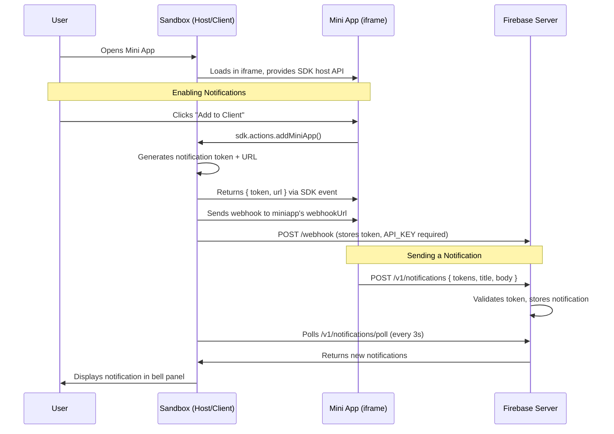

<div align="center">
  
  <h1>MiniApps Sandbox</h1>
  <p>Development sandbox for Farcaster Mini Apps with Startale App</p>
</div>

---

## Overview

Build and test Farcaster Mini Apps that integrate with **Startale App** for wallet authentication and Soneium blockchain interactions.

**Key Features:**
- Startale Wallet Authentication
- Soneium Network Support
- Wagmi Integration
- Mini Apps Gallery
- Push Notifications via Firebase

---

## Quick Start

### Start All Services

```bash
pnpm dev
```

This starts:
- **Sandbox** at `http://localhost:3100` — host/client UI

---

## Add Your Mini App

Edit [src/pages/configMiniApps.ts](src/pages/configMiniApps.ts) and add your Mini App to the gallery.

---

## Login Flow

The sandbox demonstrates authentication using Startale SDK:

1. **Connect** - Users connect via Startale App (RainbowKit UI)
2. **Smart Contract Wallet** - Startale returns a smart contract wallet address (not EOA)
3. **Session** - Access the address via `const { address } = useAccount()`

---

## Notifications

### How Notifications Work

The sandbox uses an external **Firebase Cloud Functions** server (hosted by Startale) as the notification relay. When a mini app sends a notification, it goes through the sandbox to Firebase, which delivers it to the user.



### Notification Flow Step by Step

**1. User adds the mini app (enables notifications)**

When the user clicks "Add to Client" in a mini app, the sandbox (acting as the Farcaster host/client):
- Generates a notification token (UUID) and a notification URL pointing to the Firebase server
- Returns `{ token, url }` to the mini app via the `miniAppAdded` SDK event
- Sends a webhook to both Firebase and the mini app's `webhookUrl` (from its `/.well-known/farcaster.json` manifest)

**2. Mini app stores the token**

The mini app receives the token and can store it however it likes. In the [demo mini app](https://github.com/anthropics/miniapp-notifications-demo), tokens are stored in-memory on the server side, keyed by wallet address (not FID, since StartaleApp users are identified by address).

**3. Mini app sends a notification**

When the mini app wants to notify the user, it POSTs to the notification URL it received:

```typescript
await fetch(notificationDetails.url, {
  method: "POST",
  headers: { "Content-Type": "application/json" },
  body: JSON.stringify({
    notificationId: crypto.randomUUID(),
    title: "Hello!",        // max 32 chars
    body: "Something happened",  // max 128 chars
    targetUrl: "https://your-miniapp.com",
    tokens: [notificationDetails.token],
  }),
});
```

**4. Sandbox displays the notification**

The sandbox polls the Firebase server every 3 seconds for new notifications and displays them in the notification bell panel in the sidebar.

### Configuration

The sandbox communicates with Firebase using an API key. Configure it via `.env.local`:

```env
VITE_NOTIFICATIONS_URL=<firebase-functions-url>
VITE_NOTIFICATIONS_API_KEY=<your-api-key>
```

See `.env.local.example` for the required variables.

**To get an API key:** Contact the Startale team. The API key is required for sandbox-to-Firebase communication.

### Rate Limits

The local sandbox enforces rate limits.

- 1 notification per 6 seconds per token

### Mini App Side: Handling Webhooks

Your mini app needs a webhook endpoint (declared in `/.well-known/farcaster.json` as `webhookUrl`) to receive lifecycle events from the host. The sandbox sends these events:

| Event | When | Payload |
|-------|------|---------|
| `miniapp_added` | User adds the app | `{ event, userAddress, notificationDetails }` |
| `miniapp_removed` | User removes the app | `{ event, userAddress }` |


Use `userAddress` (not FID) to identify users — StartaleApp users are identified by wallet address.

### Using Neynar (Alternative)

[Neynar](https://neynar.com) is a third-party service that simplifies notification management. It stores tokens for you and provides a simple API. However, Neynar requires Farcaster IDs (FIDs), which don't exist for StartaleApp-only users. 

---

## Documentation

### Build Your Own Mini App

**[INTEGRATION.md](./INTEGRATION.md)** — Step-by-step guide:
- Creating and signing a Farcaster Mini App
- Integrating Startale SDK
- Wagmi configuration
- Code examples
---

## License

MIT

---

<div align="center">
  <p>Built with care for the Startale ecosystem</p>
</div>
