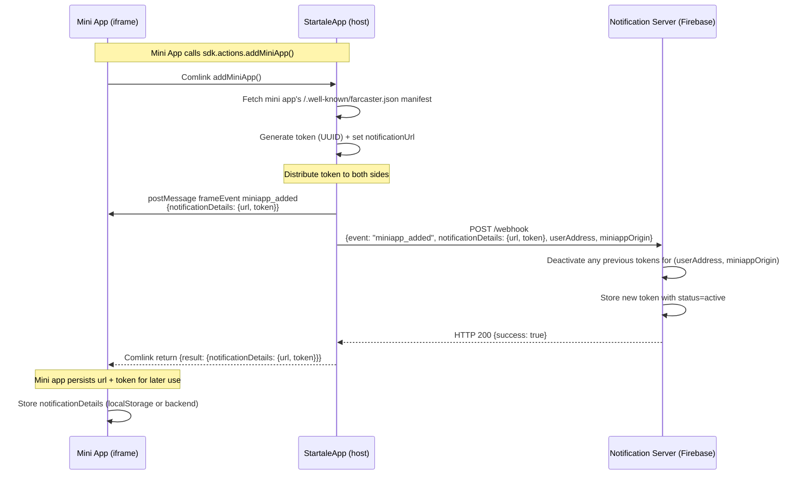
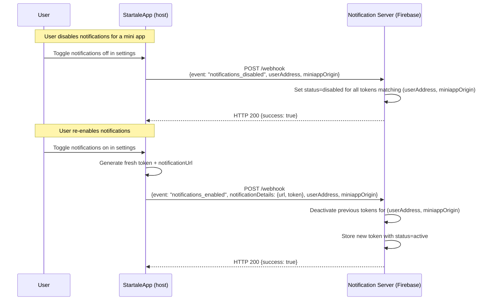
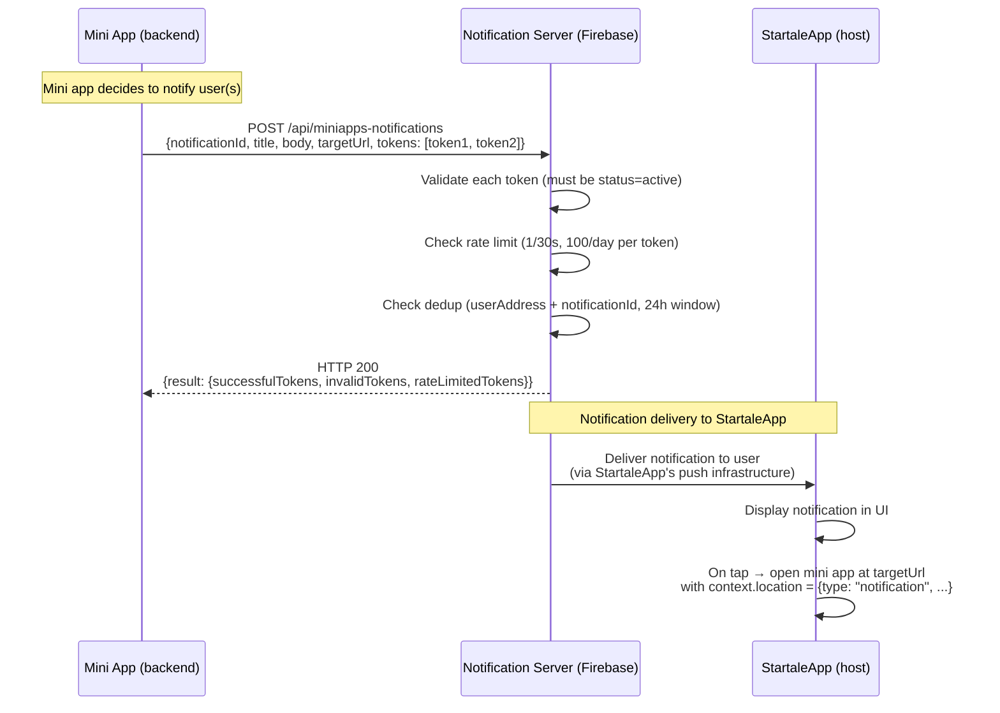
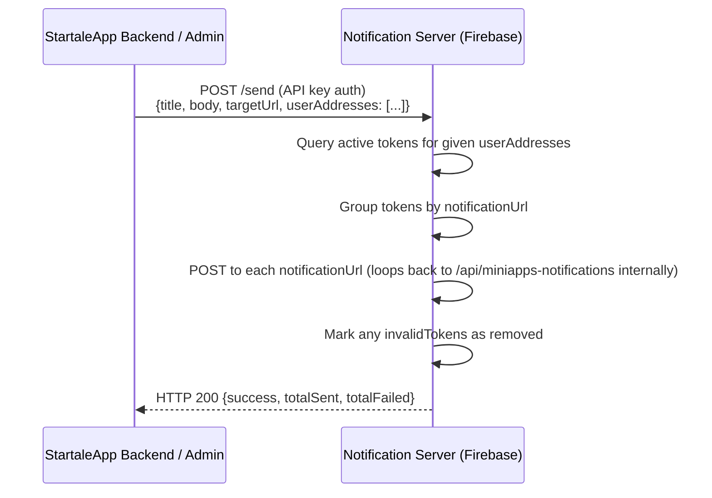

# Firebase Notification Server for Farcaster Mini Apps — Project Spec

A reference document for creating a standalone Firebase project that serves as the notification server for Farcaster-compatible mini apps hosted by **StartaleApp**. With this document you should be able to spawn a new Firebase project from scratch with 3 environments (production, staging, dev).

This project lives in its own repository. It has no dependencies on any other Startale codebase.

---

## Actors

| Actor | Description |
|---|---|
| **StartaleApp** | The production Farcaster host application. Acts as a Farcaster client — manages users, generates notification tokens, POSTs webhook lifecycle events. Uses the **production** and **staging** Firebase environments. |
| **StartaleApp-sandbox** | Local development sandbox for testing mini apps. Acts as a Farcaster host in development. Uses the **dev** Firebase environment. |
| **Mini App** | A third-party application loaded inside StartaleApp or StartaleApp-sandbox. Sends notifications to users via the ingest endpoint. |
| **Notification Server** | This Firebase project. Stores tokens, validates requests, enforces rate limits, and acts as the notification relay between mini apps and StartaleApp. |
| **Neynar** (external, optional) | Third-party managed service that some mini apps use instead of rolling their own notification backend. From this server's perspective, Neynar is just another mini app backend — it calls the same `/api/miniapps-notifications` endpoint with the same tokens. No special handling needed. |

---

## Context

StartaleApp is a Farcaster host that runs mini apps inside iframes. Mini apps communicate with StartaleApp via `postMessage` + Comlink (a transparent RPC layer over postMessage). When users add a mini app and enable notifications, StartaleApp generates a notification token and sends it (via webhook) to this notification server. Mini apps then use that token to send notifications to users through this server.

This standalone Firebase project must:

- Receive webhook lifecycle events from StartaleApp / StartaleApp-sandbox (API key auth)
- Store notification tokens per user/miniapp/client
- Accept notification send requests from mini app backends
- Enforce rate limits and deduplication per the Farcaster spec
- Support 3 environments: **production**, **staging**, **dev**

---

## Message Flows

All three actors participate in the notification lifecycle. The diagrams below show the full communication between StartaleApp (the Farcaster host), the Mini App (iframe), and the Notification Server (this Firebase project).

### Flow 1: Adding a Mini App + Token Generation

When a user adds a mini app, StartaleApp generates a notification token and distributes it to both the mini app and the notification server.



**Key points:**
- StartaleApp generates the token — not the mini app, not the notification server
- The `url` in `notificationDetails` points to this notification server's `/api/miniapps-notifications` endpoint
- The mini app receives the token via both `postMessage` (frame event) and the Comlink return value
- If the mini app's manifest declares a `webhookUrl`, StartaleApp also POSTs the event there (allowing the mini app's own backend to store the token independently)

### Flow 2: Enabling / Disabling Notifications

Users can toggle notifications from StartaleApp's UI (e.g. a settings panel). These actions do not involve the mini app iframe — they are between StartaleApp and the notification server only.



**Key points:**
- Disabling does NOT delete tokens — it sets status to `disabled` (reversible)
- Re-enabling generates a **fresh token** (the old one is deactivated, not reused)
- Removing a mini app (`miniapp_removed`) follows the same pattern but sets status to `removed`
- The mini app iframe is not involved in enable/disable — but if its manifest has a `webhookUrl`, StartaleApp also forwards the event there

### Flow 3: Sending a Notification

When a mini app wants to notify a user, it POSTs directly to the notification server. The notification server validates the token and delivers the notification to StartaleApp for display.



**Key points:**
- The mini app's **backend** sends notifications — not the iframe. The `url` + `token` from Flow 1 are used here.
- The mini app POSTs directly to the notification server, not to StartaleApp
- Up to 100 tokens can be batched in a single request
- `notificationId` enables deduplication — same `(userAddress, notificationId)` is silently skipped within 24h
- When the user taps the notification, StartaleApp opens the mini app at `targetUrl` and sets the launch context to `{type: "notification", notification: {notificationId, title, body}}`

### Alternative: `/send` Convenience Endpoint

StartaleApp's own backend (or admin tools) can also trigger notifications via the `/send` endpoint, which queries tokens from the database and fans out:



---

## Project Structure

```
startale-notifications/
├── .firebaserc                    # project aliases (prod, staging, dev)
├── firebase.json                  # functions, firestore config
├── firestore.rules                # security rules
├── firestore.indexes.json         # composite indexes
├── functions/
│   ├── package.json
│   ├── tsconfig.json
│   ├── src/
│   │   ├── index.ts               # Cloud Function exports
│   │   ├── config.ts              # environment config loader
│   │   ├── routes/
│   │   │   ├── webhook.ts         # POST /webhook — lifecycle events
│   │   │   ├── ingest.ts          # POST /api/miniapps-notifications
│   │   │   ├── send.ts            # POST /send — convenience batch send
│   │   │   ├── platformBroadcast.ts  # POST /platform-broadcast — notify all platform users
│   │   │   ├── health.ts          # GET /health
│   │   │   └── tokens.ts          # GET /tokens — admin inspection
│   │   ├── services/
│   │   │   ├── tokenStore.ts      # Firestore CRUD for notification tokens
│   │   │   ├── rateLimiter.ts     # Per-token rate limiting
│   │   │   ├── deduplication.ts   # notificationId dedup (24h window)
│   │   │   └── webhookAuth.ts      # Webhook request authentication
│   │   ├── middleware/
│   │   │   ├── auth.ts            # API key validation for /webhook, /send, /platform-broadcast, /tokens
│   │   │   └── cors.ts            # CORS configuration
│   │   └── types.ts               # Shared TypeScript types
│   └── .env.example               # template for secrets
├── scripts/
│   ├── setup-environments.sh      # creates 3 Firebase projects + aliases
│   └── deploy.sh                  # deploy to a specific environment
└── README.md                      # setup + usage guide
```

---

## Firebase Services Used

| Service | Purpose |
|---|---|
| **Cloud Functions (2nd gen)** | HTTP endpoints (webhook, ingest, send, health, tokens) |
| **Firestore** | Token storage, rate limit counters, dedup records |
| **Firebase App Check** (optional) | Protect endpoints from abuse |
| **Secret Manager** | Store API keys and secrets |

---

## Webhook Security

The `/webhook` endpoint receives lifecycle events (`miniapp_added`, `miniapp_removed`, etc.). Only StartaleApp (production/staging) and StartaleApp-sandbox (dev) should call it.

Since both sides — StartaleApp and the notification server — are Startale's own infrastructure, a shared **API key** is sufficient. There is no third party to prove identity to.

> **Note on JFS:** The Farcaster spec defines JFS (JSON Farcaster Signature) for authenticating webhooks sent to *third-party mini app backends*, so the mini app can verify the webhook really came from a legitimate Farcaster host. That does not apply here — StartaleApp is calling its own notification server. If StartaleApp also forwards lifecycle events to a mini app's own `webhookUrl`, *that* call would use JFS, but that is StartaleApp's responsibility, not this server's.

### What StartaleApp must do (the caller)

When a user adds a mini app or toggles notifications, StartaleApp POSTs the event to the notification server's `/webhook` endpoint with the `API_KEY` in the header:

```ts
await fetch(`${notificationServerUrl}/webhook`, {
  method: "POST",
  headers: {
    "Content-Type": "application/json",
    "x-api-key": process.env.NOTIFICATION_SERVER_API_KEY
  },
  body: JSON.stringify({
    event: "miniapp_added",
    userAddress: user.smartAccountAddress,
    miniappOrigin: "https://some-miniapp.com",
    notificationDetails: { url, token }
  })
});
```

The same pattern applies for all 4 event types. The `userAddress` and `miniappOrigin` are included in the body so the notification server knows which user and which mini app the event is for.

### What the Notification Server must do (this Firebase project)

1. Validate the `x-api-key` header against the stored `API_KEY` secret
2. Parse the JSON body to extract `event`, `userAddress`, `miniappOrigin`, and (optionally) `notificationDetails`
3. Handle the event (store/update/remove tokens in Firestore)
4. Return `200 { success: true }`

If the API key is missing or invalid, return `401`.

---

## Firestore Data Model

### Collection: `tokens`

Document ID: auto-generated

```ts
{
  userAddress: string;                  // user's smart account address (H160, e.g. "0x1234...abcd")
  token: string;                // notification token (unique)
  notificationUrl: string;      // URL to call when sending notifications
  miniappOrigin: string;        // origin of the miniapp
  status: 'active' | 'disabled' | 'removed';
  createdAt: Timestamp;
  updatedAt: Timestamp;
}
```

**Indexes:**
- `token` (unique — enforced via a separate `tokenLookup/{token}` doc pattern or query)
- Composite: `(userAddress, miniappOrigin, status)` — for lifecycle upserts
- Composite: `(status, miniappOrigin)` — for batch send queries

### Collection: `users`

Document ID: `{userAddress}`

```ts
{
  userAddress: string;           // user's smart account address
  firstSeenAt: Timestamp;        // when this user first added any mini app
  lastActiveAt: Timestamp;       // updated on each miniapp_added event
}
```

Upserted during `miniapp_added` webhook processing. See [Platform Broadcast](#platform-broadcast-notify-all-users) for details.

### Collection: `rateLimits`

Document ID: `{token}`

```ts
{
  lastSentAt: Timestamp;        // for 30-second throttle
  dailyCount: number;           // notifications sent today
  dailyResetAt: Timestamp;      // when dailyCount resets (midnight UTC)
}
```

### Collection: `dedup`

Document ID: `{userAddress}_{notificationId}`

```ts
{
  createdAt: Timestamp;         // auto-expires via TTL policy (24h)
}
```

Use Firestore TTL policy on `createdAt` field to auto-delete after 24 hours.

---

## API Endpoints

All endpoints are served via a single Cloud Function (HTTP-triggered, Hono app).

### `POST /webhook`

**Called by:** StartaleApp (production/staging) or StartaleApp-sandbox (dev)

**Auth:** API key (`x-api-key` header) — same key used for `/send` and `/tokens`.

**Input:**
```json
{
  "event": "miniapp_added",
  "userAddress": "0x1234567890abcdef1234567890abcdef12345678",
  "miniappOrigin": "https://some-miniapp.com",
  "notificationDetails": {
    "url": "https://<notification-server>/api/miniapps-notifications",
    "token": "a05059ef2415c67b08ecceb539201cbc6"
  }
}
```

`notificationDetails` is included for `miniapp_added` and `notifications_enabled` events only.

**Processing:**
1. Validate API key
2. Parse JSON body to extract `event`, `userAddress`, `miniappOrigin`
3. Handle event:
   - `miniapp_added` / `notifications_enabled`: Deactivate existing tokens for `(userAddress, miniappOrigin)`, insert new active token
   - `miniapp_removed` / `notifications_disabled`: Set status to `removed`/`disabled` for `(userAddress, miniappOrigin)`
4. Return `200 { success: true }`

### `POST /api/miniapps-notifications`

**Called by:** Mini app backends (this is the `notificationUrl` given to mini apps by StartaleApp)

**Input:**
```json
{
  "notificationId": "string (max 128)",
  "title": "string (max 32)",
  "body": "string (max 128)",
  "targetUrl": "string",
  "tokens": ["string (max 100 items)"]
}
```

**Processing:**
1. Validate input with Zod
2. For each token:
   a. Look up in Firestore — must be `status: active`
   b. Check rate limit: 1/30s and 100/day per token
   c. Check dedup: `(userAddress, notificationId)` not seen in 24h
   d. Categorize as `successfulTokens`, `invalidTokens`, or `rateLimitedTokens`
3. Return:
```json
{
  "result": {
    "successfulTokens": ["..."],
    "invalidTokens": ["..."],
    "rateLimitedTokens": ["..."]
  }
}
```

### `POST /send`

**Called by:** StartaleApp backend / admin tools (protected by API key)

**Input:**
```json
{
  "title": "string",
  "body": "string",
  "targetUrl": "string",
  "notificationId": "string (optional, auto-generated if omitted)",
  "userAddresses": ["0x1234...abcd", "0x5678...ef01"],
  "miniappOrigin": "string"
}
```

`userAddresses` and `miniappOrigin` are optional filters. Omit both to target all active tokens.

**Processing:**
1. Validate API key (from `x-api-key` header)
2. Query active tokens (optionally filtered by userAddresses/miniappOrigin)
3. Group tokens by `notificationUrl`
4. For each group: POST to the `notificationUrl` (the Farcaster client's ingest endpoint)
5. Collect results, mark `invalidTokens` as `removed`
6. Return summary: `{ success, results[], totalSent, totalFailed }`

### `GET /tokens`

**Protected by:** API key (`x-api-key` header)

Returns token records with optional filters: `?status=active&userAddress=0x1234...abcd&miniappOrigin=https://...`

Response: `{ tokens: TokenRecord[], count: number }`

### `GET /health`

Public. Returns `{ status: "ok", version, activeTokens (count) }`.

---

## Webhook Events

The 4 lifecycle events POSTed to `/webhook` by StartaleApp. All events include `userAddress` and `miniappOrigin` at the top level.

### `miniapp_added`

User added the miniapp in StartaleApp. Includes notification token. Adding a miniapp implicitly enables notifications.

```json
{
  "event": "miniapp_added",
  "userAddress": "0x1234567890abcdef1234567890abcdef12345678",
  "miniappOrigin": "https://some-miniapp.com",
  "notificationDetails": {
    "url": "https://<notification-server>/api/miniapps-notifications",
    "token": "a05059ef2415c67b08ecceb539201cbc6"
  }
}
```

### `miniapp_removed`

User removed the miniapp. All tokens for this `(userAddress, miniappOrigin)` pair should be invalidated.

```json
{
  "event": "miniapp_removed",
  "userAddress": "0x1234567890abcdef1234567890abcdef12345678",
  "miniappOrigin": "https://some-miniapp.com"
}
```

### `notifications_disabled`

User disabled notifications. Tokens for this `(userAddress, miniappOrigin)` pair should be marked disabled.

```json
{
  "event": "notifications_disabled",
  "userAddress": "0x1234567890abcdef1234567890abcdef12345678",
  "miniappOrigin": "https://some-miniapp.com"
}
```

### `notifications_enabled`

User re-enabled notifications after disabling. Includes a fresh token.

```json
{
  "event": "notifications_enabled",
  "userAddress": "0x1234567890abcdef1234567890abcdef12345678",
  "miniappOrigin": "https://some-miniapp.com",
  "notificationDetails": {
    "url": "https://<notification-server>/api/miniapps-notifications",
    "token": "a05059ef2415c67b08ecceb539201cbc6"
  }
}
```

---

## Rate Limiting Implementation

Per Farcaster spec:
- **1 notification per 30 seconds** per token
- **100 notifications per day** per token

Implemented via `rateLimits` collection in Firestore. On each ingest request:
1. Read rate limit doc for the token
2. If `lastSentAt` is within 30 seconds → `rateLimitedTokens`
3. If `dailyCount >= 100` and `dailyResetAt` is still today → `rateLimitedTokens`
4. Otherwise: update `lastSentAt`, increment `dailyCount`, proceed

Daily counter resets when `dailyResetAt < now` (checked at read time, reset atomically in a Firestore transaction).

---

## Deduplication

Per Farcaster spec, `(userAddress, notificationId)` should be deduplicated over a 24-hour window.

- On ingest: check if `dedup/{userAddress}_{notificationId}` doc exists
- If yes: skip (already sent)
- If no: create doc with `createdAt = now`
- Firestore TTL policy on `createdAt` auto-deletes after 24h

This allows mini app developers to safely retry send requests using a stable `notificationId`.

---

## Multi-Environment Setup

### Firebase Projects

Create 3 separate Firebase projects:

| Alias | Project ID | Used by | Purpose |
|---|---|---|---|
| `default` | `startale-notifs-dev` | StartaleApp-sandbox | Local development + dev deploys |
| `staging` | `startale-notifs-staging` | StartaleApp (staging) | Pre-production testing |
| `production` | `startale-notifs-prod` | StartaleApp (production) | Live traffic |

### `.firebaserc`

```json
{
  "projects": {
    "production": "startale-notifs-prod",
    "staging": "startale-notifs-staging",
    "default": "startale-notifs-dev"
  }
}
```

### `firebase.json`

```json
{
  "functions": [
    {
      "source": "functions",
      "codebase": "default",
      "ignore": ["node_modules", ".git"],
      "predeploy": ["npm --prefix \"$RESOURCE_DIR\" run build"]
    }
  ],
  "firestore": {
    "rules": "firestore.rules",
    "indexes": "firestore.indexes.json"
  }
}
```

### `firestore.indexes.json`

```json
{
  "indexes": [
    {
      "collectionGroup": "tokens",
      "queryScope": "COLLECTION",
      "fields": [
        { "fieldPath": "userAddress", "order": "ASCENDING" },
        { "fieldPath": "miniappOrigin", "order": "ASCENDING" },
        { "fieldPath": "status", "order": "ASCENDING" }
      ]
    },
    {
      "collectionGroup": "tokens",
      "queryScope": "COLLECTION",
      "fields": [
        { "fieldPath": "status", "order": "ASCENDING" },
        { "fieldPath": "miniappOrigin", "order": "ASCENDING" }
      ]
    },
    {
      "collectionGroup": "tokens",
      "queryScope": "COLLECTION",
      "fields": [
        { "fieldPath": "token", "order": "ASCENDING" }
      ]
    },
    {
      "collectionGroup": "tokens",
      "queryScope": "COLLECTION",
      "fields": [
        { "fieldPath": "userAddress", "order": "ASCENDING" },
        { "fieldPath": "status", "order": "ASCENDING" },
        { "fieldPath": "createdAt", "order": "DESCENDING" }
      ]
    }
  ],
  "fieldOverrides": []
}
```

### Per-Environment Secrets

Use Firebase Secret Manager:

```bash
# Set secrets for staging
firebase use staging
firebase functions:secrets:set API_KEY

# Set secrets for production
firebase use production
firebase functions:secrets:set API_KEY

# Dev — optionally set WEBHOOK_SECRET for sandbox auth
firebase use default
firebase functions:secrets:set API_KEY
```

### Environment Variables

| Variable | Production | Staging | Dev |
|---|---|---|---|
| `API_KEY` | Required | Required | Required |

In `config.ts`:
```ts
import { defineSecret } from "firebase-functions/params";

export const apiKey = defineSecret("API_KEY");
```

### Deployment

```bash
# Deploy to dev (default)
firebase deploy --only functions,firestore

# Deploy to staging
firebase use staging && firebase deploy --only functions,firestore

# Deploy to production
firebase use production && firebase deploy --only functions,firestore
```

---

## Firestore Security Rules

```
rules_version = '2';
service cloud.firestore {
  match /databases/{database}/documents {
    // All access goes through Cloud Functions — deny direct client access
    match /{document=**} {
      allow read, write: if false;
    }
  }
}
```

All data access happens server-side via the Admin SDK (Cloud Functions), so no client rules are needed.

---

## Setup Script: `scripts/setup-environments.sh`

```bash
#!/bin/bash
set -e

PROJECTS=("startale-notifs-dev" "startale-notifs-staging" "startale-notifs-prod")
ALIASES=("default" "staging" "production")

for i in "${!PROJECTS[@]}"; do
  echo "Creating project: ${PROJECTS[$i]}"
  firebase projects:create "${PROJECTS[$i]}" --display-name "${PROJECTS[$i]}"
  firebase use --add "${PROJECTS[$i]}" --alias "${ALIASES[$i]}"

  # Enable Firestore
  firebase firestore:databases:create --project "${PROJECTS[$i]}" --location us-central1

  # Enable Cloud Functions
  echo "Enable Cloud Functions via console: https://console.firebase.google.com/project/${PROJECTS[$i]}/functions"
done

echo ""
echo "Done. Now set secrets for each environment:"
echo "  firebase use <alias> && firebase functions:secrets:set API_KEY"
```

## Deploy Script: `scripts/deploy.sh`

```bash
#!/bin/bash
set -e

ENV="${1:-default}"

echo "Deploying to: $ENV"
firebase use "$ENV"
firebase deploy --only functions,firestore
echo "Deployed to $ENV"
```

Usage: `./scripts/deploy.sh staging`

---

## Key Dependencies (`functions/package.json`)

```json
{
  "name": "startale-notifications",
  "scripts": {
    "build": "tsc",
    "serve": "firebase emulators:start --only functions,firestore",
    "deploy": "firebase deploy --only functions,firestore",
    "deploy:staging": "firebase use staging && npm run deploy",
    "deploy:prod": "firebase use production && npm run deploy"
  },
  "engines": { "node": "20" },
  "dependencies": {
    "firebase-admin": "^12.0.0",
    "firebase-functions": "^6.0.0",
    "hono": "^4.7.0",
    "zod": "^3.24.0",
    "uuid": "^11.0.0"
  },
  "devDependencies": {
    "typescript": "^5.5.0",
    "firebase-functions-test": "^3.0.0"
  }
}
```

### `functions/tsconfig.json`

```json
{
  "compilerOptions": {
    "target": "ES2022",
    "module": "NodeNext",
    "moduleResolution": "NodeNext",
    "outDir": "./lib",
    "rootDir": "./src",
    "strict": true,
    "esModuleInterop": true,
    "skipLibCheck": true,
    "declaration": true,
    "sourceMap": true
  },
  "include": ["src/**/*"],
  "exclude": ["node_modules"]
}
```

### `.env.example`

```
# API key for protected endpoints (/webhook, /send, /tokens)
API_KEY=
```

---

## Entry Point (`functions/src/index.ts`)

Single Cloud Function exporting a Hono app:

```ts
import { onRequest } from "firebase-functions/v2/https";
import { Hono } from "hono";
import { apiKey } from "./config";
import { webhookRoute } from "./routes/webhook";
import { ingestRoute } from "./routes/ingest";
import { sendRoute } from "./routes/send";
import { platformBroadcastRoute } from "./routes/platformBroadcast";
import { healthRoute } from "./routes/health";
import { tokensRoute } from "./routes/tokens";
import { corsMiddleware } from "./middleware/cors";

const app = new Hono();

app.use("*", corsMiddleware);
app.route("/webhook", webhookRoute);
app.route("/api/miniapps-notifications", ingestRoute);
app.route("/send", sendRoute);
app.route("/platform-broadcast", platformBroadcastRoute);
app.route("/health", healthRoute);
app.route("/tokens", tokensRoute);

export const notifications = onRequest(
  { secrets: [apiKey] },
  app.fetch
);
```

---

## Platform Broadcast: Notify All Users

StartaleApp admin may need to notify **all platform users** regardless of which mini app they use — e.g. announcing a new mini app, a platform update, or a maintenance window.

### Users Collection

A `users` collection is built as a side effect of `miniapp_added` webhook processing. When the notification server handles a `miniapp_added` event, it also upserts a doc in the `users` collection keyed by `userAddress`. This gives the platform a deduplicated registry of all users who have ever added any mini app.

#### Collection: `users`

Document ID: `{userAddress}`

```ts
{
  userAddress: string;           // user's smart account address
  firstSeenAt: Timestamp;        // when this user first added any mini app
  lastActiveAt: Timestamp;       // updated on each miniapp_added event
}
```

**Upsert logic in `/webhook` handler for `miniapp_added`:**
- If doc exists: update `lastActiveAt`
- If doc does not exist: create with `firstSeenAt = now`, `lastActiveAt = now`

This adds one extra Firestore write per `miniapp_added` event — negligible overhead.

### `POST /platform-broadcast`

**Called by:** StartaleApp backend / admin tools only

**Auth:** API key (`x-api-key` header) — same key as `/webhook`, `/send`, and `/tokens`.

> **Security: admin-only endpoint.** This endpoint sends notifications to every user on the platform. It **must not** be publicly accessible. Unlike `/api/miniapps-notifications` (which any mini app backend can call with a valid token), `/platform-broadcast` is gated by the API key and should only be called by StartaleApp's own backend or admin tooling. The API key must never be exposed to mini app developers or frontend code.

**Input:**
```json
{
  "title": "New mini app: GameX",
  "body": "Try out GameX — now available on StartaleApp!",
  "targetUrl": "https://startale.app/miniapps/gamex",
  "notificationId": "platform-announce-gamex-2024-03-15"
}
```

A stable `notificationId` is required (not auto-generated) to ensure safe retries and deduplication.

**Processing:**
1. Validate API key
2. Query all docs from the `users` collection (paginated, 500 per page via Firestore cursor)
3. For each user, query **one** active token (most recent `createdAt`) from the `tokens` collection — any mini app's token works since the notification opens a platform URL, not a mini app URL
4. Batch the collected tokens into groups of 100
5. POST each batch to the corresponding `notificationUrl` (loops through `/api/miniapps-notifications` internally)
6. Track results, mark `invalidTokens` as `removed`
7. Return summary

**Response:**
```json
{
  "success": true,
  "totalUsers": 1200,
  "totalSent": 1194,
  "totalFailed": 6
}
```

Users who have removed all their mini apps (no active tokens) are silently skipped — they remain in the `users` collection but receive no notification.

### Scalability

The synchronous paginated approach handles thousands of users within Cloud Functions' 540s timeout. If the platform grows beyond that, introduce Cloud Tasks fan-out (enqueue one task per page of users, return a `broadcastId` immediately, add a `GET /broadcasts/{broadcastId}` status endpoint). This is a future enhancement.

### Updates to Project Structure

Add the new route and collection:

- `functions/src/routes/platformBroadcast.ts` — the `/platform-broadcast` handler
- Register in `index.ts`: `app.route("/platform-broadcast", platformBroadcastRoute)`

### Updates to Firestore Indexes

Add to `firestore.indexes.json`:

```json
{
  "collectionGroup": "tokens",
  "queryScope": "COLLECTION",
  "fields": [
    { "fieldPath": "userAddress", "order": "ASCENDING" },
    { "fieldPath": "status", "order": "ASCENDING" },
    { "fieldPath": "createdAt", "order": "DESCENDING" }
  ]
}
```

This supports the "pick one active token per user, most recent first" query.

---

## Testing

### Stack

- **Test runner:** Vitest
- **Firestore:** `@firebase/rules-unit-testing` with the Firestore emulator — tests run against a real (local) Firestore instance, not mocks
- **HTTP:** Use Hono's `app.request()` to call endpoints directly (no need for a running server)
- **Emulator:** `firebase emulators:start --only firestore` must be running before tests. Configure via `firebase.json` emulator settings.

### Project Structure

```
functions/
├── src/
│   └── ...
├── test/
│   ├── setup.ts              # emulator connection, Firestore cleanup between tests
│   ├── webhook.test.ts        # /webhook endpoint tests
│   ├── ingest.test.ts         # /api/miniapps-notifications endpoint tests
│   ├── send.test.ts           # /send endpoint tests
│   ├── platformBroadcast.test.ts  # /platform-broadcast endpoint tests
│   ├── rateLimiter.test.ts    # rate limiting service tests
│   └── deduplication.test.ts  # dedup service tests
├── vitest.config.ts
└── package.json
```

### Test Setup (`test/setup.ts`)

Each test file should:
1. Connect to the Firestore emulator (`localhost:8080` by default)
2. Clear all Firestore data between tests using `clearFirestoreData()` from `@firebase/rules-unit-testing`
3. Provide a helper to build the Hono app with a test API key injected

### What to Test

#### `/webhook` — `webhook.test.ts`

| Test | What it verifies |
|---|---|
| `miniapp_added` creates token doc | Token stored with `status: active`, correct `userAddress`, `miniappOrigin`, `notificationUrl` |
| `miniapp_added` upserts user doc | `users/{userAddress}` created with `firstSeenAt` and `lastActiveAt` |
| `miniapp_added` twice for same user | `lastActiveAt` updated, no duplicate user doc, previous token deactivated |
| `miniapp_added` for new miniapp same user | Both tokens active (different `miniappOrigin`), single user doc |
| `notifications_disabled` sets status | Token status changes to `disabled` |
| `notifications_enabled` creates fresh token | Old token deactivated, new token active with new value |
| `miniapp_removed` sets status | Token status changes to `removed` |
| Missing API key returns 401 | Auth rejection |
| Invalid API key returns 401 | Auth rejection |
| Malformed body returns 400 | Validation error |

#### `/api/miniapps-notifications` — `ingest.test.ts`

| Test | What it verifies |
|---|---|
| Valid token delivers notification | Token in `successfulTokens` response |
| Invalid token (not in DB) | Token in `invalidTokens` |
| Disabled token | Token in `invalidTokens` |
| Removed token | Token in `invalidTokens` |
| Batch of mixed tokens | Correct categorization across `successfulTokens`, `invalidTokens`, `rateLimitedTokens` |
| Max 100 tokens enforced | Request with 101 tokens returns 400 |
| Missing required fields | Returns 400 for missing `title`, `body`, `tokens`, etc. |
| `notificationId` max length (128) | Returns 400 if exceeded |
| `title` max length (32) | Returns 400 if exceeded |

#### Rate Limiting — `rateLimiter.test.ts`

| Test | What it verifies |
|---|---|
| First notification passes | No rate limit hit |
| Second notification within 30s | Token in `rateLimitedTokens` |
| Notification after 30s passes | Rate limit resets |
| 100th notification in a day passes | At daily limit |
| 101st notification in same day | Token in `rateLimitedTokens` |
| Daily counter resets after midnight UTC | Counter reset, notification passes |

#### Deduplication — `deduplication.test.ts`

| Test | What it verifies |
|---|---|
| First send with `notificationId` passes | Dedup doc created |
| Same `(userAddress, notificationId)` within 24h | Silently skipped |
| Different `notificationId` same user | Both pass |
| Same `notificationId` different user | Both pass |

#### `/send` — `send.test.ts`

| Test | What it verifies |
|---|---|
| Send to specific `userAddresses` | Only those users' tokens queried |
| Filter by `miniappOrigin` | Only tokens for that miniapp |
| `invalidTokens` marked as `removed` | Firestore status updated after send |
| Missing API key returns 401 | Auth rejection |

#### `/platform-broadcast` — `platformBroadcast.test.ts`

| Test | What it verifies |
|---|---|
| Broadcasts to all users | Each user in `users` collection receives one notification |
| User with multiple miniapps gets one notification | Dedup by `userAddress` — picks one token |
| User with no active tokens is skipped | No error, `totalSent` excludes them |
| Stable `notificationId` deduplicates on retry | Second call skips already-delivered users |
| Missing API key returns 401 | Auth rejection |
| Invalid API key returns 401 | Auth rejection — endpoint is admin-only |
| Request without `x-api-key` header from external origin | Rejected, not publicly accessible |

### Manual / Integration Verification

After unit tests pass, verify end-to-end against the emulator:

1. `firebase emulators:start --only functions,firestore` — run functions + Firestore locally
2. POST `miniapp_added` to `/webhook` → inspect Firestore for token + user docs
3. POST to `/api/miniapps-notifications` with the token → verify response
4. POST to `/platform-broadcast` → verify fan-out
5. Deploy to dev environment and repeat with real Firebase
