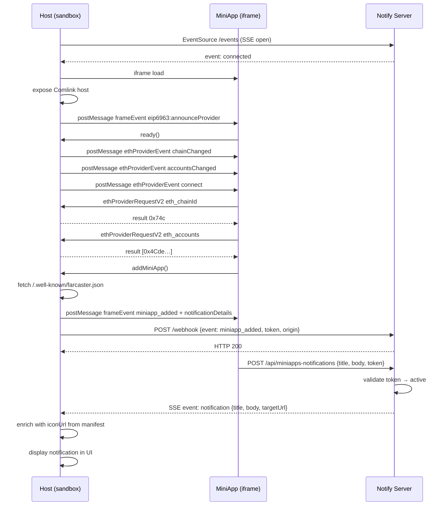

# MiniApp Message Flow

```mermaid
sequenceDiagram
    participant H as Host (sandbox)
    participant M as MiniApp (iframe)
    participant N as Notify Server

    H->>N: EventSource /events (SSE open)
    N-->>H: event: connected

    H->>M: iframe load
    H->>H: expose Comlink host
    H->>M: postMessage frameEvent eip6963:announceProvider

    M->>H: ready()

    H->>M: postMessage ethProviderEvent chainChanged
    H->>M: postMessage ethProviderEvent accountsChanged
    H->>M: postMessage ethProviderEvent connect

    M->>H: ethProviderRequestV2 eth_chainId
    H-->>M: result 0x74c

    M->>H: ethProviderRequestV2 eth_accounts
    H-->>M: result [0x4Cde…]

    M->>H: addMiniApp()
    H->>H: fetch /.well-known/farcaster.json
    H->>M: postMessage frameEvent miniapp_added + notificationDetails
    H->>N: POST /webhook {event: miniapp_added, token, origin}
    N-->>H: HTTP 200

    M->>N: POST /api/miniapps-notifications {title, body, token}
    N->>N: validate token → active
    N-->>H: SSE event: notification {title, body, targetUrl}
    H->>H: enrich with iconUrl from manifest
    H->>H: display notification in UI
```
