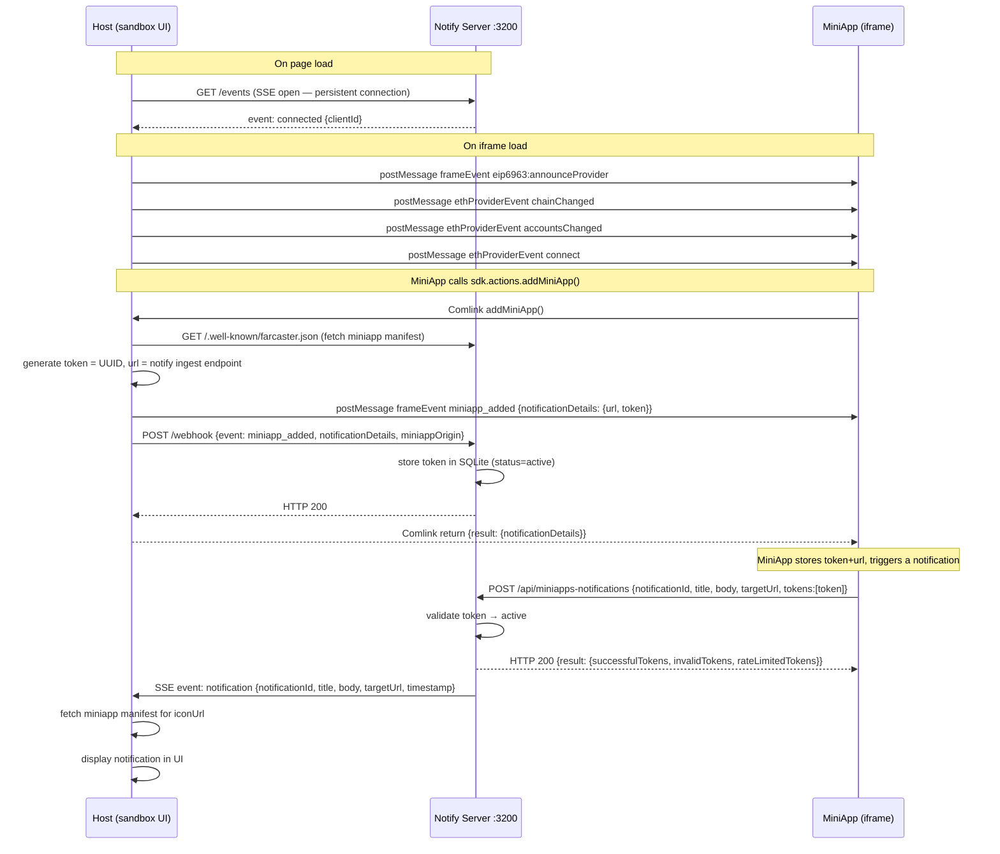

# Notification System — Spec

A reference document for how notifications work across the three actors in the sandbox. Grounded in the actual code under `notify/src/`.

---

## The Three Actors

| Actor | Role | Location |
|---|---|---|
| **Host** | The sandbox shell that hosts miniapps in iframes. Generates tokens, mediates the Farcaster SDK, listens to SSE. | `src/` — `FarcasterMiniappHost.tsx`, `NotificationProvider.tsx` |
| **Notify Server** | Standalone HTTP server. Stores tokens in SQLite, receives notifications from miniapps, fans out to the host via SSE. | `notify/src/` — runs on port 3200 |
| **MiniApp** | The iframe application being sandboxed. Calls host actions via Comlink and POSTs notifications directly to the notify server. | External app loaded in iframe |

---

## Full Message Flow



---

## Token Lifecycle

A token is a UUID generated by the **host** at the moment `addMiniApp()` is called. It binds a specific user (fid) to a specific miniapp origin and a notification delivery URL.

```
miniapp_added / notifications_enabled  →  status: active
notifications_disabled                 →  status: disabled
miniapp_removed                        →  status: removed
ingest: token not found in DB          →  returned in invalidTokens[]
send: endpoint returns invalidTokens   →  status: removed (auto-cleanup)
```

A new `addMiniApp()` call always deactivates any previous token for the same `(fid, miniapp_origin)` pair before inserting a fresh one. This prevents stale token accumulation.

The token row in SQLite carries: `id, fid, token, notification_url, miniapp_origin, status, created_at, updated_at`.

---

## JFS — Signed Webhook Payloads

In production Farcaster, webhook POST bodies are wrapped in **JFS (JSON Farcaster Signature)** format:

```
{
  header:    <base64url-encoded JSON: {fid, type, key}>
  payload:   <base64url-encoded JSON: the actual event>
  signature: <base64url-encoded signature bytes>
}
```

The notify server tries JFS first, extracts the `fid` from the header, decodes the payload, then falls back to plain JSON if the JFS parse fails. The signature is **not verified** in the sandbox — it is trusted for local development. In production Farcaster, signature verification is mandatory.

---

## Notify Server API — `:3200`

### `POST /webhook`
**Called by:** the Host (and in production, by Farcaster itself)

Handles miniapp lifecycle events. Accepts either JFS-wrapped or plain JSON.

| Event | Effect |
|---|---|
| `miniapp_added` | Deactivates previous tokens for (fid, origin), inserts new active token |
| `notifications_enabled` | Same as `miniapp_added` — re-activates notifications |
| `miniapp_removed` | Sets status = `removed` for all tokens matching (fid, origin) |
| `notifications_disabled` | Sets status = `disabled` for all tokens matching (fid, origin) |

Response: `{ success: true }`

---

### `POST /api/miniapps-notifications`
**Called by:** the MiniApp directly (this is the `url` the host hands to the miniapp)

This is the Farcaster-standard notification ingest endpoint. The miniapp sends notifications here using the token it received from the host.

Request body:
- `notificationId` — deduplification ID (max 128 chars)
- `title` — max 32 chars
- `body` — max 128 chars
- `targetUrl` — deep link opened when user taps the notification
- `tokens` — array of token strings (max 100)

Processing:
1. Each token is looked up in SQLite
2. Token with `status = active` → `successfulTokens`
3. Any other status or missing → `invalidTokens`
4. If there are successful tokens → broadcast SSE `notification` event to all connected host clients

Response: `{ result: { successfulTokens, invalidTokens, rateLimitedTokens } }`

> `rateLimitedTokens` is always empty in the sandbox. In production Farcaster, rate limits (1/30s, 100/day per token) are enforced here.

---

### `POST /send`
**Called by:** sandbox UI or any external tool (developer convenience endpoint)

Lets you send a notification to active tokens without needing the miniapp to do it. Useful for testing from curl, the sandbox UI, or a backend server.

Request body:
- `title`, `body`, `targetUrl` — same as ingest
- `notificationId` — optional (auto-generated if omitted)
- `fids` — optional array of fids to filter recipients (omit = all active tokens)

Processing:
1. Query active tokens from SQLite (optionally filtered by fid)
2. Group tokens by `notification_url`
3. For each group: `POST` the notification payload to the `notification_url` (which loops back to `/api/miniapps-notifications`)
4. Collect results, mark any `invalidTokens` as `removed` in DB
5. Broadcast SSE `notification` event regardless of HTTP results

Response: `{ success, results[], totalSent, totalFailed }`

> The `/send` endpoint calls `/api/miniapps-notifications` as a sub-request — it does not bypass token validation.

---

### `GET /events`
**Called by:** the Host (`NotificationProvider`) on page load — kept open for the session

SSE (Server-Sent Events) stream. Clients receive:

| Event | When |
|---|---|
| `connected` | Immediately on connection — carries `{ clientId }` |
| `notification` | When ingest or send broadcasts a notification |

The notify server holds an in-memory list of connected SSE clients. When a notification is processed, it fans out to all of them simultaneously. Disconnected clients are silently skipped and cleaned up on the next `cancel` callback.

---

### `GET /tokens`
**Called by:** sandbox UI (developer inspection)

Returns all token records, optionally filtered.

Query params:
- `status` — filter by `active` / `disabled` / `removed`
- `fid` — filter by user fid

Response: `{ tokens: TokenRecord[], count: number }`

---

### `GET /health`
**Called by:** monitoring, startup checks

Returns server status.

Response: `{ status: "ok", uptime, activeTokens, sseClients, version }`

---

## Host API (FarcasterMiniappHost)

The host does not expose HTTP endpoints. It communicates with the miniapp via `postMessage` + **Comlink** (a transparent RPC layer over postMessage).

### Comlink actions the miniapp can call

| Action | What the host does |
|---|---|
| `addMiniApp()` | Fetches manifest for webhookUrl, generates `{url, token}`, posts `miniapp_added` frame event to miniapp, POSTs to `/webhook`, optionally POSTs to miniapp's own webhookUrl |
| `ready()` | No-op acknowledgement that the miniapp has finished loading |
| `close()` | Calls the host's `onClose` callback, closing the iframe |
| `openUrl(url)` | Opens URL in a new tab |
| `ethProviderRequest(req)` | Dispatches EIP-1193 RPC method, returns result |
| `ethProviderRequestV2(req)` | Same but wrapped in JSON-RPC 2.0 envelope |
| `getCapabilities()` | Returns list of supported capability strings |
| `getChains()` | Returns `["eip155:1868"]` (Soneium) |
| `eip6963RequestProvider()` | Posts `eip6963:announceProvider` frame event to miniapp |
| `signIn()`, `signManifest()` | Always return `rejected_by_user` in the sandbox |
| `sendToken()`, `swapToken()` | Always return `not_supported` in the sandbox |
| `viewCast()`, `viewProfile()`, `openMiniApp()`, etc. | No-ops in the sandbox |

### postMessage events host sends to miniapp

| Event type | When |
|---|---|
| `frameEvent: eip6963:announceProvider` | On iframe load and on `eip6963RequestProvider` call |
| `frameEvent: miniapp_added` | When `addMiniApp()` is called successfully |
| `frameEthProviderEvent: chainChanged` | 500ms after iframe load |
| `frameEthProviderEvent: accountsChanged` | 500ms after iframe load |
| `frameEthProviderEvent: connect` | 500ms after iframe load (if wallet connected) |

### SSE subscription (NotificationProvider)

On page load, the host opens a persistent `EventSource` to `http://localhost:3200/events`. When a `notification` SSE event arrives, it:
1. Parses the payload
2. Fetches the miniapp's `/.well-known/farcaster.json` manifest (via `/api/miniapp-manifest` proxy, with per-origin caching) to get `iconUrl`
3. Adds the enriched notification to the in-memory list
4. Increments the unread badge counter

---

## MiniApp Responsibilities

The miniapp is not a server — it has two integration points:

### 1. `sdk.actions.addMiniApp()`
Calling this via the Farcaster SDK triggers the host's `addMiniApp` Comlink handler. The return value contains `notificationDetails: { url, token }`. The miniapp must persist these (e.g. `localStorage` or its own backend) for later use.

### 2. `POST {url}` — sending a notification
The `url` from `notificationDetails` points to `/api/miniapps-notifications` on the notify server. The miniapp (or its backend) calls this directly whenever it wants to send a notification. The host is not involved in this call.

### 3. `/.well-known/farcaster.json` — the manifest
If the miniapp declares a `webhookUrl` in its manifest:
```json
{ "miniapp": { "webhookUrl": "https://..." } }
```
The host will also POST the `miniapp_added` event to that URL. This allows the miniapp's backend to receive lifecycle events independently — useful for persisting tokens server-side or integrating with Neynar.

---

## Sandbox vs Production

| Concern | Sandbox | Production Farcaster |
|---|---|---|
| Token generation | Host generates UUID locally | Farcaster client generates and manages |
| Webhook verification | JFS format accepted but signature not verified | Signature verification is mandatory |
| Rate limits | Not enforced | 1 notification / 30s, 100 / day per token |
| Token storage | SQLite on localhost | Farcaster infrastructure |
| Notification delivery | SSE to local UI | Push notification to user's Farcaster client |
| `fid` | Hardcoded to 3 ("George") | Real user's fid from the signed header |

---

## Neynar (Optional Third-Party Layer)

Neynar sits on the **miniapp side**, not the host side. It is a managed service that:
- Receives `webhookUrl` lifecycle events and stores tokens on your behalf
- Provides a simple send API so you do not need to manage token lists yourself
- Handles token invalidation and retry automatically

To use it, set `webhookUrl` in your manifest to your Neynar app endpoint, then call the Neynar send API instead of `/api/miniapps-notifications` directly. The notify server is bypassed entirely when using Neynar in production — it is only used in the local sandbox.
